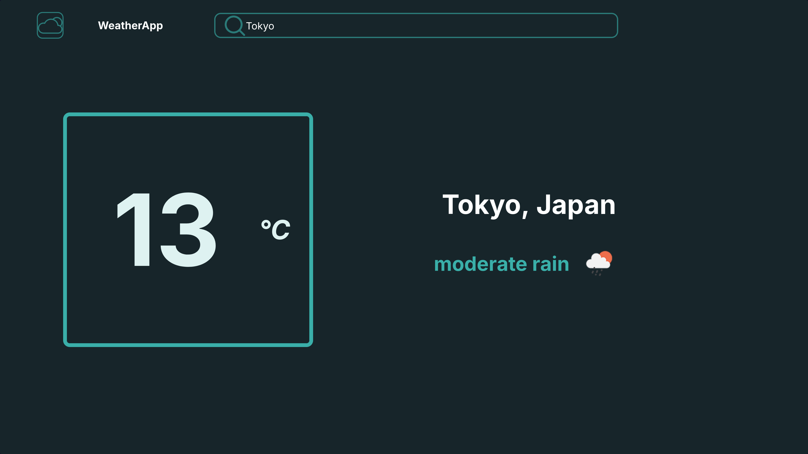

# Unnamed React Weather App
a project I made in order to learn the basics of react + vite



## Features:
After typing in the name of a city to the search bar and pressing enter the website displays the current temperature as well as the 'weather overview' for the selected city.

## Setup
inside a terminal navigate to the project directory and run 
```sh
npm install
```

next generate an openweatherapp PAT and go to ./src/TopBar/Search_Bar.jsx and change this line 
```js
const apiKey = 'your api key';
```
to your PAT

then to run the app, execute 
```sh 
npm run dev
```

the website will now be available on the port vite directs you to
